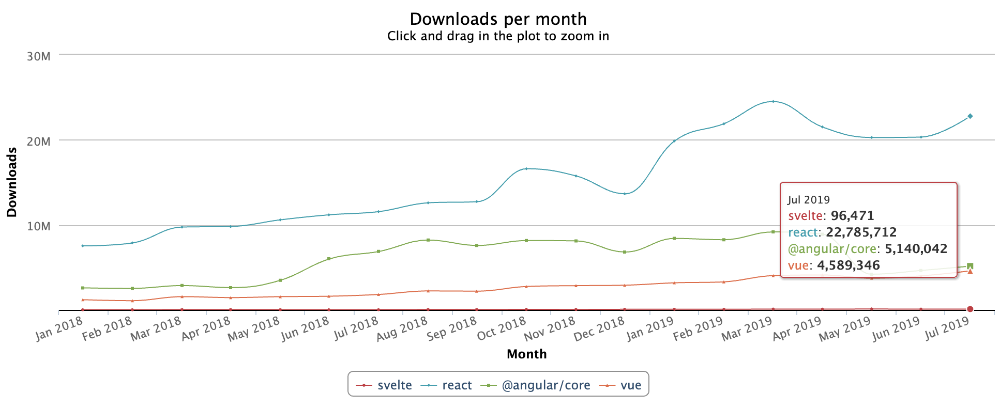

# Svelte: Is This Next-Generation JavaScript Framework Production-Ready?

The selection of technologies available to build web applications is constantly evolving and ever-changing. It seems as if every other month there is a shiny new framework that has caught the JavaScript community's attention. Most of these trends spark up and fizzle out quickly, but occasionally you'll come across something that has people asking, "Is this the next big thing?"

Svelte happens to be one of those technologies.

## What is Svelte?

[Svelte](https://svelte.dev) is a component-based JavaScript user interface framework, similar to React or Vue. Component-based frameworks allow developers to build user interfaces by creating composable components that are re-usable across multiple contexts. Svelte differs from the major frameworks, however, in the way it handles changes to an application's state. Svelte adds code at *compile time* to surgically update the document object model (DOM) rather than relying on *runtime* techniques (e.g., [virtual DOM diffing](https://programmingwithmosh.com/react/react-virtual-dom-explained/)). Web applications built with Svelte tend to have smaller bundle sizes and significant performance gains due to the elimination of the overhead that comes with maintaining a virtual DOM.

In April 2019, Rich Harris, the author of Svelte, announced the major release of Svelte 3. During his talk, ["Rethinking Reactivity"](https://www.youtube.com/watch?v=AdNJ3fydeao) at You Gotta Love Frontend Code Camp 2019, Rich summarized the significance of this release: "Svelte 3 moves reactivity out of the component API and into the language." This dramatic overhaul of the framework was heavily inspired by reactive programming paradigms and introduced new features like reactive assignments, reactive stores, and reactive declarations.

## Is Svelte Ready for Production?

The recent release of Svelte 3 has garnered new interest in the JavaScript community for adopting this framework. Whether or not Svelte is ready for production has yet to reach a consensus. Let's consider some of the cases for and against using Svelte to build web applications:

### Pros
- **Simple Component Model**: Developers who are familiar with other component-based frameworks will find themselves at home when working with Svelte's component model. The new reactivity features added in Svelte 3 simplify components even further. As a result, Svelte components can often be written in [fewer lines of code](https://www.freecodecamp.org/news/a-realworld-comparison-of-front-end-frameworks-with-benchmarks-2019-update-4be0d3c78075/#lines-of-code-tl-dr) compared to their Angular, React, or Vue equivalents.
- **Solid Performance Benchmarks**: Svelte [outclasses the competition](https://twitter.com/rich_harris/status/1065992585095929857) in most performance benchmarks it's included in. This is primarily because Svelte accounts for state update logic at compile time rather than relying on naive runtime techniques like virtual DOM diffing.
- **Small Application Bundle Sizes**: Similar to the previous case, Svelte ships applications without the overhead of a JavaScript framework runtime, which leads to [smaller bundle sizes](https://www.freecodecamp.org/news/a-realworld-comparison-of-front-end-frameworks-with-benchmarks-2019-update-4be0d3c78075/#size-tl-dr). In addition, any optional features of this framework, such as stores and transitions, are excluded from the bundled output if they are not used.
- **Shallow Learning Curve**: Getting started with Svelte is easy. Developers can either try out the [Svelte REPL](https://svelte.dev/repl) in their browser or create a new project from the scaffold template by running `npx degit sveltejs/template my-svelte-project`. The Svelte website also includes an [interactive tutorial](https://svelte.dev/tutorial/basics) and plenty of [examples](https://svelte.dev/examples#hello-world).

### Cons

- **Limited Adoption**: The most notable early adopters of Svelte are GoDaddy and *The New York Times* (Rich Harris' current employer). React, Vue, and Angular are still the choice JavaScript frameworks among large companies.

source: <a href="https://npm-stat.com">npm-stat.com</a>

- **Immature Developer Tooling** — The Svelte compiler provides some degree of linting and static analysis capabilities for developers. However, there is no DevTools equivalent for Svelte to debug applications post-compilation. Fortunately, there is an [open GitHub issue](https://github.com/sveltejs/svelte/issues/2931) to track the development of this tool for the Svelte ecosystem. 
- **Small Selection of Third-Party Component Libraries** — Developers will often pull in third-party component libraries, such as Bootstrap or Material, into their project to increase development velocity. Unfortunately, ports of these component libraries to Svelte are largely incomplete.
- **Doesn't Play Well With Others** — Although the Svelte compiler itself is written in TypeScript, the framework's component API does not officially support TypeScript. This feature is a must-have for developers who have reaped the benefits of TypeScript for enhancing code quality and team scalability.

Is Svelte ready for production? Almost — but not yet. 

While Svelte introduces some innovative concepts to challenge the paradigms of leading JavaScript frameworks, it has limited proven use in production for enterprise-scale applications. Following the format of ThoughtWorks' [Technology Radar](https://www.thoughtworks.com/radar/faq), I would place Svelte in the **Assess** phase of adoption — I think the project is worth keeping an eye on, but not quite mature enough to trial in production.

In the next year, we might see the project take significant strides toward maturity. The Svelte community is small but growing. Svelte's author has been transparent about the [current limitations](https://twitter.com/Rich_Harris/status/1121021795212177408) of the framework, and the community is working diligently on these areas of improvement. 

## Recommended Use Cases

If you are willing to accept the risks that come with adopting bleeding-edge technology, I would recommend trialing Svelte for the following use cases:

- **Small Single Page Applications**: Consider writing a pilot application using Svelte that is large enough to begin to understand the limitations of the framework, but small enough to have an acceptable switching cost if you decide to rewrite it using another framework.
- **Custom Interactives or Visualizations**: If you are building data-driven visualizations that need to display a large number of DOM elements, the performance gains that come from a framework with no runtime overhead will ensure that user interactions are snappy and responsive.
- **Web Applications Intended for Low Power Devices** — Applications built with Svelte have smaller bundle sizes, which is ideal for devices with slow network connections and limited processing power.

Credera's [Product Design & Development](https://www.credera.com/service-area/product-design-development/) service area is all about helping our clients deliver best-in-class digital experiences to their customers. Contact us at [findoutmore@credera.com](mailto:findoutmore@credera.com) to learn more about how we can partner with you.
